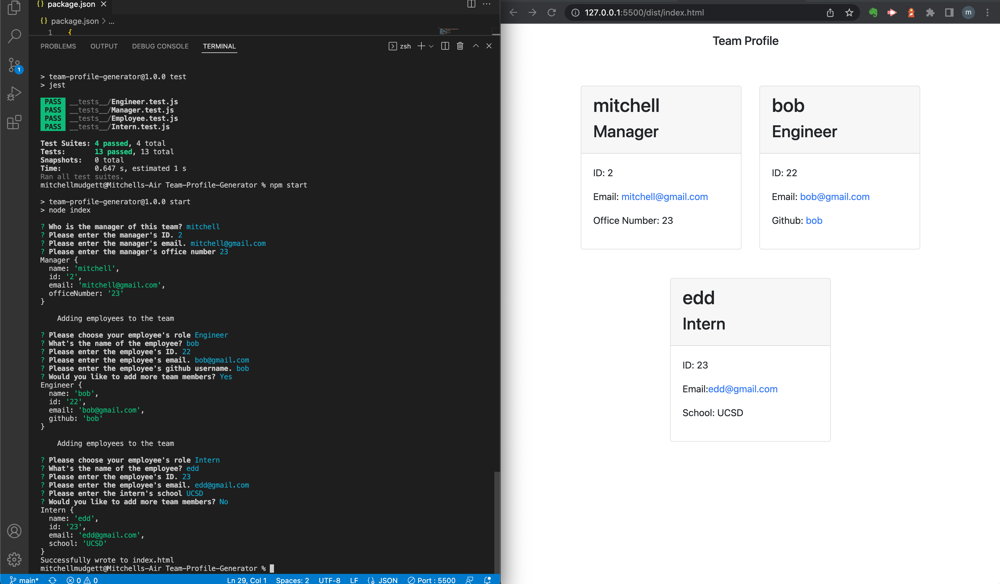

# Team-Profile-Generator

## Task: To create a Node.js application that utilizes Inquirer to receive information from the user and produce a file along with proper testing functionality using Jest.
* Goal: To create a program that accepts information from a team leader and produces a clean html file that displays their employee information.
* Specifications: The program must properly accept input regarding employees, split into a manager, interns, and engineers. The basic employee parent class will have inputs for a name, id, and email. Depending on what the user decides they can then choose to add an office number for a manager, a github profile for an engineer, or a school of attendance for interns. This information will then be displayed on a webpage through an html file.
* Points of Emphasis: The project will show an understanding of Object-Oriented programming. 
* Completion: This project is completed when the application code is submitted, and a video exhibiting its capabilies is recorded then posted here:

* Application: 